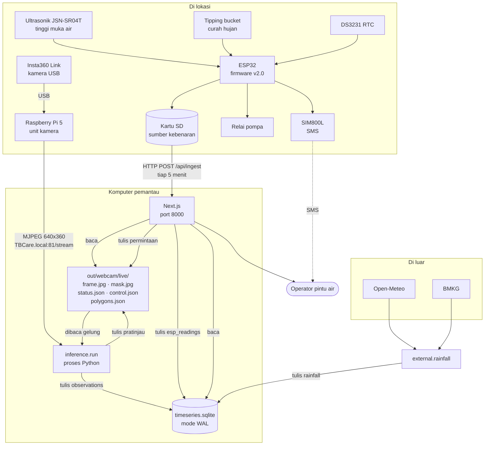
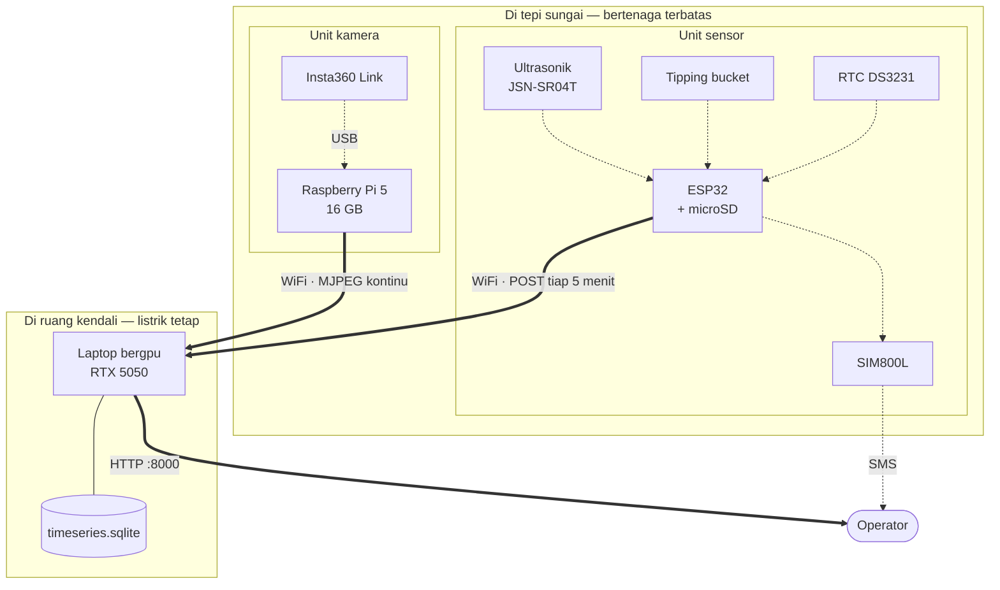
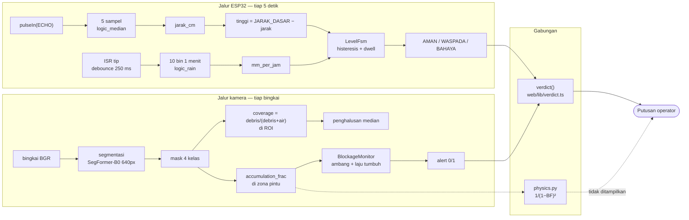
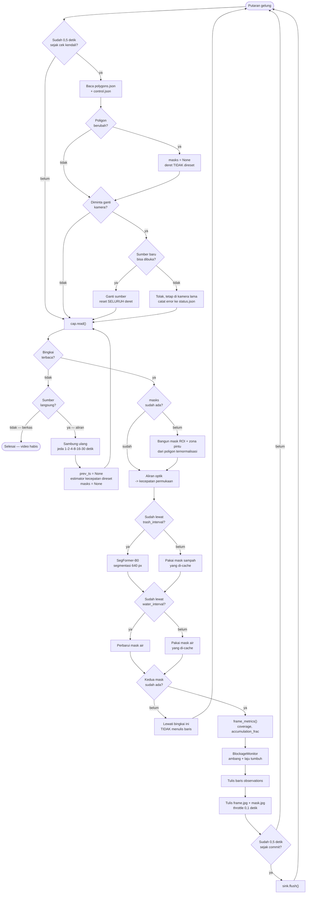
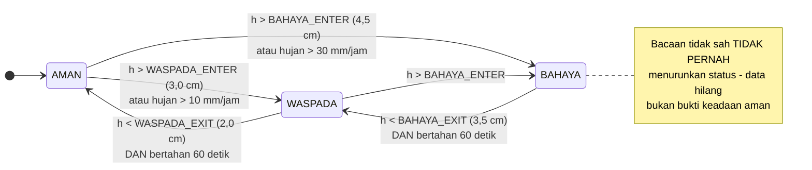
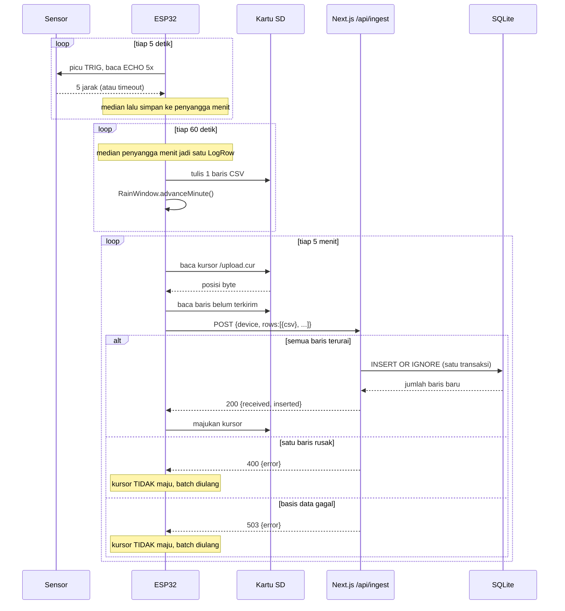
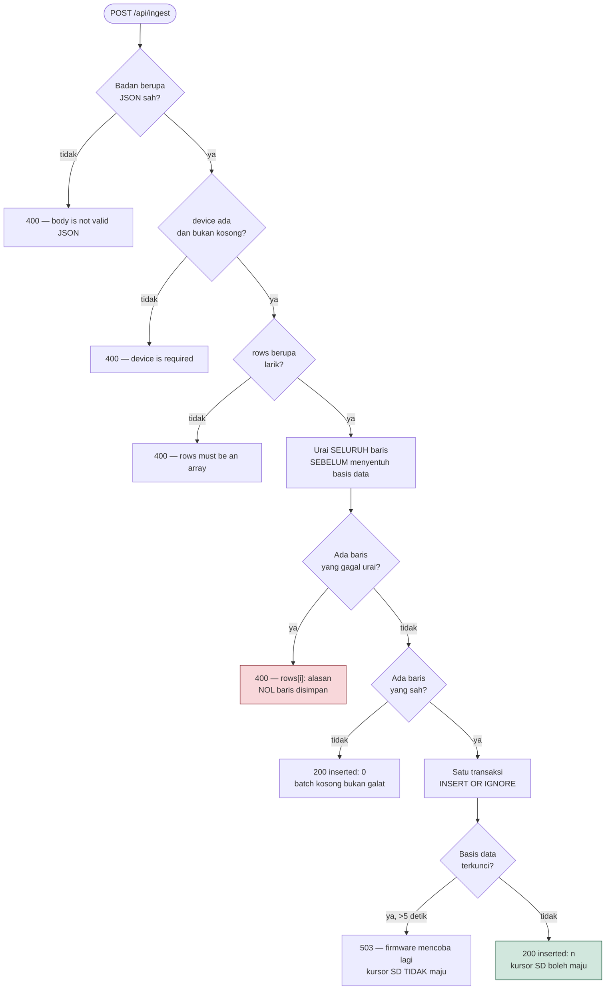
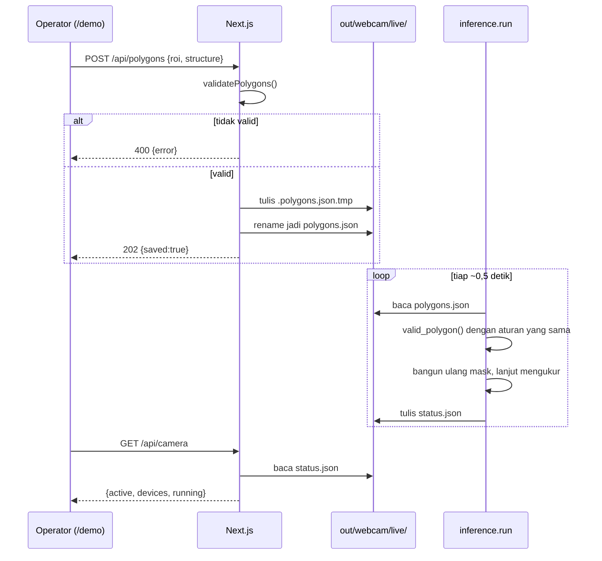

# 3. Arsitektur Sistem dan Diagram Alir

[← Daftar isi](README.md) · [← Sebelumnya: Dokumentasi teknis](02-dokumentasi-teknis.md)

---

## 3.1 Gambaran satu layar

Tiga proses yang berdiri sendiri, satu berkas basis data sebagai titik temu.



**Dua hal yang perlu diperhatikan dari gambar ini.**

Pertama, tidak ada satu pun panah dari web ke proses inferensi selain lewat
berkas. Itu disengaja, dan alasannya di §3.5.

Kedua, **kamera tidak menempel pada komputer pemantau.** Ia menempel pada
Raspberry Pi di lokasi, yang mengalirkan MJPEG lewat jaringan. Batas itu adalah
satu-satunya tempat citra menyeberangi kabel, dan menaruhnya di sana membuat
mesin bergpu boleh berada di mana saja — termasuk jauh dari sungai. Pi tidak
menjalankan model; rinciannya di [04 §4.7](04-spesifikasi.md).

---

### 3.1b Penempatan fisik — apa yang di lapangan, apa yang di server

Diagram §3.1 menunjukkan aliran data. Diagram ini menunjukkan **di mana tiap
bagian benar-benar berada**, karena batas fisik itulah yang menentukan apa yang
selamat saat sesuatu mati.



**Yang menentukan pembagian ini:** perangkat di tepi sungai harus murah, tahan
cuaca, dan hemat daya. GPU tidak memenuhi satu pun dari ketiganya. Karena itu
tidak ada model yang berjalan di lapangan — yang ada di sana hanya pembaca sensor
dan pengalir video.

**Konsekuensi yang harus diakui, dan berbeda untuk tiap unit:**

| Kalau server mati | Unit sensor | Unit kamera |
|---|---|---|
| Data saat itu | **Selamat** — ditulis ke microSD dulu | **Hilang** — tidak disimpan di Pi |
| Setelah server hidup | Baris tertunda terkirim menyusul | Mulai dari bingkai baru |
| Peringatan ke operator | **Tetap jalan** — SMS lewat SIM800L | Tidak ada |

Baris terakhir itu yang paling berarti untuk sistem peringatan banjir: **jalur SMS
tidak melewati server sama sekali.** ESP32 mengirimnya langsung lewat SIM800L, jadi
peringatan tingkat BAHAYA tetap sampai meski seluruh sisi komputer padam.

---

## 3.2 Kontrak antar-komponen

Ada empat batas dalam sistem ini. Tiap batas punya satu kontrak, dan tiap
kontrak punya berkas yang memilikinya.

| # | Batas | Bentuk kontrak | Pemilik |
|---|---|---|---|
| 1 | ESP32 → web | CSV 14 kolom di dalam amplop JSON | `logic_csv.h` ↔ `web/lib/esp-csv.ts` |
| 2 | Inferensi → web | Tabel `observations` di SQLite | `src/inference/sink.py` |
| 3 | Web → inferensi | Berkas JSON di `live/`, ditulis atomik | `control.py` ↔ `api/camera`, `api/polygons` |
| 4 | Pengambil hujan → web | Tabel `rainfall` di SQLite | `src/external/rainfall.py` |

Semua kontrak searah kecuali #3, dan #3 pun bukan panggilan — ia titipan berkas.

**Kontrak #1 bersifat posisional, bukan bernama.** Firmware menulis dengan satu
`snprintf`:

```c
"%s,%lu,%.1f,%.1f,%d,%u,%lu,%u,%.1f,%s,%u,%s,%d,%s\n"
```

Urutan kolom **adalah** kontraknya. Menyisipkan kolom di tengah `logic_csv.h`
tanpa mengubah `ESP_COLUMNS` di `esp-csv.ts` akan menggeser setiap nilai
sesudahnya, dan tidak ada yang melempar galat — angka salah masuk kolom yang
salah tanpa suara. Kalau kolom harus ditambah, **tambahkan di akhir**, lalu
naikkan panjang yang diharapkan di kedua sisi.

---

## 3.3 Alur data — dari sensor sampai putusan



> **Garis putus-putus itu bukan hiasan.** Rantai afflux tetap dihitung di
> `src/physics.py`, tetapi **tidak lagi sampai ke layar** — kartu "Perkiraan
> kenaikan muka air" dihapus dari halaman operator, dan kembaran TypeScript-nya
> (`web/lib/fisika.ts`) ikut terhapus. Yang menentukan apa yang dibaca operator
> sekarang hanyalah `verdict()`.
>
> Ini layak disebut karena operator justru meminta **debit air** sebagai
> informasi utama (bagian G2 wawancara), dan perhitungannya sudah ada — hanya
> jalur tampilnya yang belum.

### 3.3b Alur keputusan per bingkai — apa yang benar-benar terjadi tiap putaran

Diagram §3.3 menunjukkan ke mana data mengalir. Diagram ini menunjukkan
**percabangannya**: apa yang diperiksa gelung inferensi pada setiap putaran, dan
kapan sebuah bingkai dilewati tanpa menghasilkan baris.



**Empat keputusan di diagram ini yang tidak terlihat dari kode sepintas:**

**Poligon berubah tidak mereset deret, ganti kamera mereset.** Menggambar ulang
zona pintu hanya memindahkan wilayah yang dihitung pada adegan yang sama, jadi
riwayat penghalusan tetap sebanding. Ganti kamera berarti adegannya benar-benar
lain — seluruh pengukuran terkumpul menjadi tidak berlaku.

**Kamera yang gagal dibuka tidak menjatuhkan gelung.** Permintaan ditolak,
alasannya ditulis ke `status.json`, dan sistem tetap mengukur dengan kamera lama.
Padam karena seseorang salah pilih perangkat adalah kegagalan yang lebih buruk
daripada permintaan yang ditolak.

**Bingkai tanpa mask lengkap dilewati, bukan ditulis nol.** Ini penerapan langsung
aturan "tidak ada pengukuran ≠ nol" pada tingkat gelung.

**Sumber langsung menyambung ulang, berkas berakhir.** Batas waktu baca FFmpeg
tiba di titik yang sama persis dengan akhir video, sehingga keduanya harus
dibedakan dari jenis sumbernya, bukan dari gejalanya.

---

### 3.3c Mesin keadaan level — histeresis dan dwell

`LevelFsm` di firmware bukan sekadar perbandingan ambang. Ia mesin keadaan dengan
dua sifat yang mencegah alarm berkedip.



| Sifat | Nilai | Kenapa |
|---|---|---|
| Naik | **seketika** | Menunda peringatan banjir tidak bisa dibenarkan |
| Turun — ambang | `EXIT` ≠ `ENTER` | Selisih 1 cm lebih lebar daripada sebaran ±0,5 cm antar-ping, jadi riak di sekitar ambang tidak membalik keadaan |
| Turun — waktu | `DWELL_DOWN_MS` 60 detik | Harus stabil di bawah ambang keluar selama satu menit penuh |
| Bacaan tidak sah | **menahan keadaan** | De-eskalasi saat sensor gagal akan mematikan pompa di tengah banjir |

**Ambang masuk memakai `>` (tegas), ambang keluar memakai `>=`.** Perbedaan satu
karakter itu diuji langsung: nilai tepat di `WASPADA_ENTER` tidak boleh naik
status, dan nilai tepat di `WASPADA_EXIT` masih terhitung WASPADA. Mutasi `>`
menjadi `>=` disuntikkan sengaja dan tertangkap oleh uji batas
([08 §8.4](08-protokol-uji.md)).

---

### Empat angka yang keluar dari rantai ini

| Angka | Dari | Arti |
|---|---|---|
| `tinggi_cm` | ESP32 | Tinggi muka air terhadap dasar, **satu titik** |
| `mm_per_jam` | ESP32 | Hujan satu jam terakhir, **di titik itu** |
| `accumulation_frac` | Kamera | Fraksi zona pintu yang tertutup sampah |
| `afflux_m` | Fisika | Berapa cm muka air hulu **akan** naik akibat penyumbatan itu |

Angka keempat itu yang membuat proyek ini berarti. Tanpa dia sistem hanya
melaporkan "pintu tertutup 24%", yang sudah diketahui operator dengan melihat.
Dengan dia sistem melaporkan "air akan duduk 59 cm lebih tinggi, dan jalan
tergenang di 29%" — sebuah akibat, cukup awal untuk ditindaklanjuti.

---

## 3.4 Urutan waktu — pengiriman ESP32 ke server



### Tiga sifat yang lahir dari urutan ini

**SD adalah sumber kebenaran, unggah hanya kemudahan.** Kursor maju **hanya**
setelah server memastikan. Kegagalan jaringan tidak pernah bisa menghilangkan
baris — baris menumpuk di kartu dan berangkat belakangan. Ini tertulis di
`hw_upload.h` sebagai komentar pertama berkas.

**2xx adalah janji.** Komentar di `api/ingest/route.ts` menyatakannya: firmware
memajukan kursor SD hanya pada 2xx, jadi 2xx dari server adalah janji bahwa
**setiap** baris sudah tersimpan permanen. Apa pun yang kurang dari itu wajib
membalas non-2xx. Karena itu pula seluruh batch diurai **sebelum** menyentuh
basis data: satu baris rusak menolak seluruh batch, dan kita tidak boleh sudah
menulis separuhnya saat itu ketahuan.

**Kirim ulang aman.** `INSERT OR IGNORE` dengan kunci utama gabungan
`(device, ts_epoch)` membuat pengiriman ulang tidak berefek. Ini penting karena
firmware mengirim ulang setiap kali tanggapan hilang di jalan — dan tanggapan
yang hilang tidak bisa dibedakan dari permintaan yang tidak pernah sampai.

---

### 3.4b Alur keputusan `/api/ingest` — semua atau tidak sama sekali

Endpoint ini punya aturan yang tidak biasa dan wajib digambarkan, karena
melanggarnya berarti kehilangan data secara permanen: **2xx adalah janji bahwa
setiap baris sudah tersimpan.** Firmware memajukan kursor SD-nya hanya pada 2xx
dan tidak pernah mengirim ulang baris itu.



**Tiga keputusan di diagram ini, semuanya berakar pada satu janji itu:**

**Penguraian selesai sebelum penulisan dimulai.** Satu baris rusak menolak seluruh
batch. Menerima sebagiannya lalu menjawab 2xx akan membuang sisanya selamanya,
karena firmware menganggap seluruh batch sudah aman.

**Batch kosong menjawab 200, bukan 400.** Berkas hanya berisi header bukan
kegagalan — tidak ada yang perlu disimpan, dan tidak ada yang salah.

**Kunci basis data menjawab 503, bukan menunggu selamanya.** Batas tunggu 5 detik
jauh lebih lama daripada penulisan apa pun yang nyata (di bawah satu milidetik),
sehingga penulis yang benar-benar macet muncul sebagai galat yang bisa dicoba
ulang firmware — bukan sebagai permintaan yang menggantung.

**Kirim ulang aman.** Kunci utama `(device, ts_epoch)` membuat `INSERT OR IGNORE`
pada baris yang sudah ada tidak melakukan apa pun; kiriman kedua menjawab
`inserted: 0` dengan status 200. Ini penting karena tanggapan yang hilang di
jaringan tidak bisa dibedakan dari permintaan yang tidak pernah sampai.

---

## 3.5 Kendali lewat berkas, bukan lewat proses

Dua endpoint (`/api/camera`, `/api/polygons`) mengubah perilaku gelung inferensi
yang **sedang berjalan**. Keduanya melakukannya dengan menulis satu berkas JSON
kecil.



**Handler ini tidak pernah menjalankan program.** Ditulis eksplisit di
`api/camera/route.ts`:

> Memberi endpoint HTTP kuasa memanggil program adalah lubang yang layak
> diserang, dan setiap muat-ulang server pengembangan akan meninggalkan anak
> proses yatim yang masih memegang kamera.

Konsekuensinya: `202 Accepted`, bukan `200 OK`. Permintaan **diterima**, bukan
**diterapkan**. Gelung mengambilnya dalam sekitar setengah detik dan melaporkan
lewat `status.json` apakah perangkatnya benar-benar terbuka.

Validasi indeks kamera pun sengaja sempit — satu digit `/^[0-9]$/`. Nilai itu
diserahkan ke `cv2.VideoCapture` di proses lain; string bebas yang sampai ke
lapisan penangkapan adalah cara sebuah jalur berkas atau URL berubah jadi
sesuatu yang tidak diinginkan siapa pun.

---

## 3.6 Mengapa satu berkas SQLite, bukan basis data server

| Pertimbangan | SQLite | Postgres/MySQL |
|---|---|---|
| Layanan yang harus hidup | 0 | 1 |
| Penulis serentak | Python + Node, lewat WAL | mudah |
| Salinan cadangan | salin satu berkas | dump |
| Jalan tanpa jaringan | ya | perlu soket |
| Beban tulis proyek ini | ~2 baris/detik | jauh di bawah kapasitas |

Mode **WAL** (commit `ba42b1a`) adalah yang membuat dua penulis mungkin: pembaca
Node tidak memblokir penulis Python, dan sebaliknya. Tanpa WAL, halaman web
yang dimuat saat inferensi menulis akan mendapat `SQLITE_BUSY`.

**Batas yang harus diakui:** semuanya di satu mesin. Kalau kelak inferensi
pindah ke Raspberry Pi di lokasi sementara web di tempat lain, berkas ini tidak
lagi jadi titik temu dan lapisan sinkronisasi harus ada. `[BELUM]` dirancang.

---

## 3.7 Kegagalan tiap komponen dan akibatnya

Ini tabel yang paling layak ditanya penguji, karena sistem peringatan dinilai
dari perilakunya saat rusak, bukan saat mulus.

| Yang mati | Akibat langsung | Yang tetap jalan | Ditandai di UI? |
|---|---|---|---|
| Kamera | `accumulation_frac` berhenti | Tinggi air, hujan, SMS | Ya — "Belum ada pengukuran" |
| Raspberry Pi mati | Aliran video berhenti; tidak ada citra yang tersimpan di Pi | Tinggi air, hujan, SMS | Ya — kartu Penumpukan menua |
| Jaringan Pi → server terputus | Sama; `run.py` menyambung ulang sendiri | Sisanya | Ya, lewat umur data |
| ESP32 | Tinggi air & hujan titik berhenti | Kamera, fisika, putusan | Ya — sumber ditandai sunyi >20 menit |
| WiFi di ESP32 | Unggah tertunda | **Semua** — SD terus mencatat, SMS terus terkirim | Tidak langsung; terlihat dari umur data |
| Ultrasonik | `tinggi_cm` hilang | Hujan, SMS, FSM **menahan** level | Ya — `valid=0` tersimpan |
| Server web mati | Unggah gagal | Firmware & inferensi jalan terus | — |
| `site_geometry.json` hilang | `src/physics.py` tidak bisa dijalankan | Seluruh tampilan web | Hanya di keluaran skrip |
| Tabel `rainfall` belum ada | `src/external/rainfall.py` belum pernah dijalankan | Seluruh tampilan web | Hanya di keluaran skrip |

Dua baris terakhir dulu mengosongkan kartu di halaman operator. Sejak kartu
"Perkiraan kenaikan muka air" dan "Hujan regional" dihapus, keduanya tidak lagi
punya jalur ke layar — fisika afflux dan curah hujan eksternal sekarang murni
sisi Python.

Dua pola yang berulang di tabel ini, dan keduanya disengaja:

1. **Kegagalan bersifat lokal.** Kamera mati tidak menjatuhkan tinggi air, dan
   ESP32 yang sunyi tidak menjatuhkan putusan penyumbatan. Tiap sumber membawa
   umurnya sendiri ke layar, jadi satu yang diam tidak menyeret yang lain.
   **Sumber langsung menyambung ulang, berkas tidak.** `run.py` membedakan
   keduanya lewat `is_live_source()`: berkas video yang habis memang berakhir,
   tetapi aliran MJPEG yang berhenti 30 detik hanyalah tautan yang putus — batas
   waktu baca FFmpeg tiba di titik yang sama persis dengan akhir video. Gelungnya
   kini menyambung ulang dengan jeda menaik 1→2→4→8→16→30 detik alih-alih keluar.
   `[TERUKUR]` 2026-08-28: sumber diputus sengaja, tersambung kembali pada
   percobaan ke-3.

   Yang di-atur ulang saat pulih hanyalah yang dirusak jeda: `prev_ts` (tanpa itu
   `dt` menjadi selama durasi putus, dan kecepatan permukaan runtuh ke ~0 px/detik
   sehingga `area_flux` ikut salah) dan estimator kecepatan (bingkai acuannya dari
   sebelum putus, jadi aliran optik lintas jeda tak bermakna). Penghalus dan
   monitor penyumbatan **dipertahankan** — adegannya sama.

2. **Sunyi selalu tampak.** Tidak ada layar yang menampilkan angka lama seolah
   baru. `waktu.ts` menghitung "5 menit lalu" sungguhan, dan `notifikasi.ts`
   menandai sumber sebagai sunyi setelah `STALE_AFTER_MINUTES` = 20.

---

## 3.8 Penjadwalan — periode setiap gelung

| Gelung | Periode | Konstanta | Alasan angkanya |
|---|---|---|---|
| Baca sensor ESP32 | 5 detik | `SENSOR_PERIOD_MS` | Cukup rapat untuk median per menit |
| Catat ke SD | 60 detik | `LOG_PERIOD_MS` | Satu baris/menit, ~525 ribu baris/tahun |
| Unggah batch | 5 menit | `UPLOAD_PERIOD_MS` | Kompromi kesegaran vs daya radio |
| Sinkron NTP | 6 jam | `NTP_PERIOD_MS` | Deriva DS3231 jauh di bawah ini |
| Ulang SMS | 5 menit | `SMS_REPEAT_MS` | Jangan membanjiri operator |
| Segmentasi (bendungan) | 30 detik | `trash_interval_s` | Air terbendung bergerak dalam menit |
| Segmentasi (webcam uji) | tiap bingkai | `trash_interval_s: 0.0` | Cukup cepat: 28 ms/bingkai di RTX 5050 |
| Pratinjau JPEG | 0,1 detik | `preview.interval_s` | ~10 pasang/detik terbaca sebagai video |

Angka pratinjau punya sebab yang layak dicatat: bukan 30 pasang/detik, karena
tiap pasang ~70 KB — menyamai laju kamera berarti ~2 MB/detik gesekan cakram
terus-menerus untuk menggambar ulang bingkai yang toh tidak bisa ditampilkan
peramban lebih cepat daripada ia mengecat ulang.

---

## 3.9 Batas arsitektur yang diketahui

- **`[BELUM]` Semuanya satu mesin.** Lihat §3.6.
- **`[BELUM]` Tidak ada autentikasi.** Endpoint `/api/ingest` menerima POST dari
  siapa pun yang bisa mencapai port 8000. Di LAN terisolasi ini dapat diterima;
  begitu terekspos ke internet, **wajib** ada token perangkat. Lihat
  [05-database-api.md §5.8](05-database-api.md).
- **`[BELUM]` Tidak ada rotasi/retensi basis data.** `observations` sudah
  419.433 baris (72 MB) hanya dari pengujian meja. Di laju bendungan (30 detik)
  itu sekitar satu juta baris per tahun — masih wajar untuk SQLite, tapi tidak
  pernah diuji sampai ke sana.
- **`[ASUMSI]` Satu titik ukur tinggi air.** Satu ultrasonik mengukur satu
  tempat. Kemiringan muka air di sepanjang kolam hulu tidak terlihat sama sekali.

---

[← Daftar isi](README.md) · [Berikutnya: Spesifikasi →](04-spesifikasi.md)
